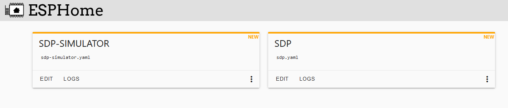
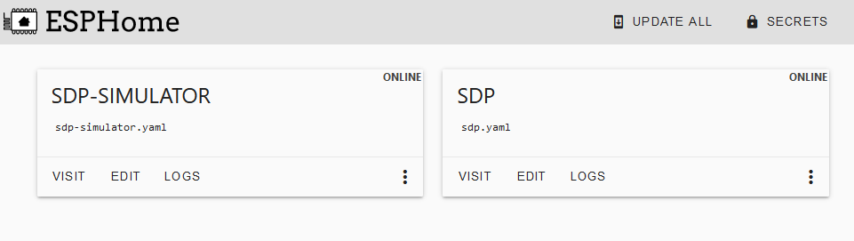
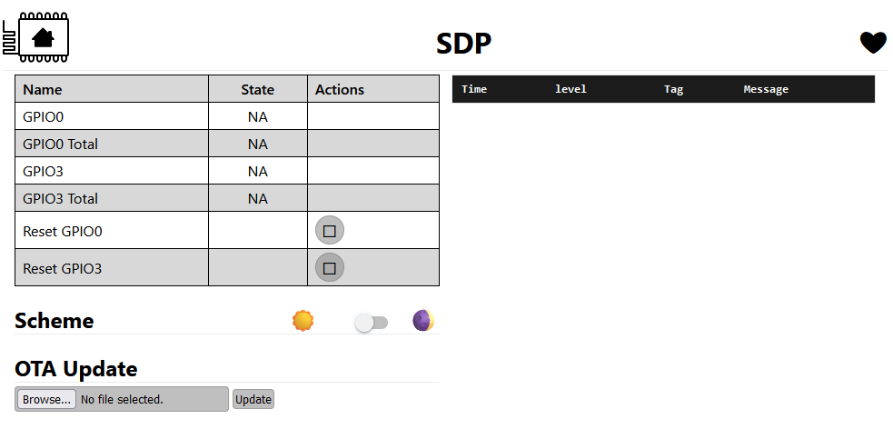
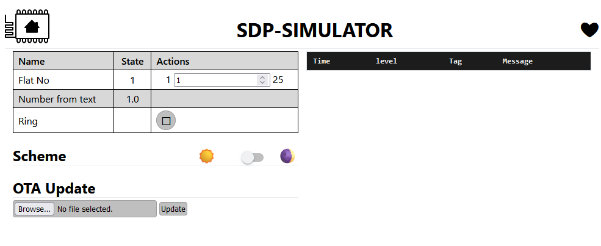
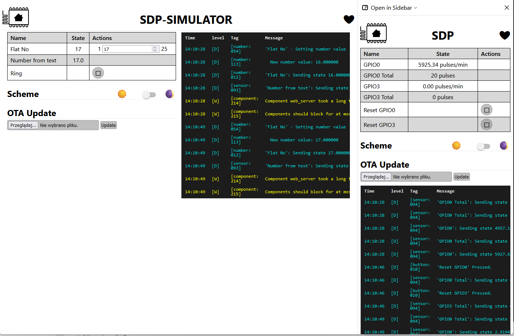
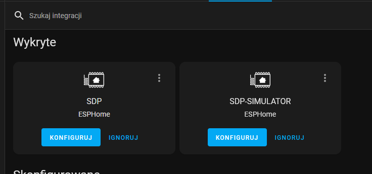

# Development

## Environment

1.  ESPHome - used separated ESPHome LXC instance here
     - [Proxmox-Helper-Scripts](https://tteck.github.io/Proxmox/) - helper scripts for ESPHome LXC (and mayn other) installation as a separate environment
        - ```bash -c "$(wget -qLO - https://github.com/tteck/Proxmox/raw/main/ct/esphome.sh)"```
          - custom settings: disk size 32GB, enable root access
2. VSCode + Remote - SSH extension
   - ```code --folder-uri "vscode-remote://ssh-remote+root@192.168.10.128/"```
3. Source code - depending on the ESPHome configuration clone repo into the ESPHome config folder
      - for ESPHome LXC config folder is /root/config
      ```
      cd /root/config
      git clone https://github.com/dawidcieszynski/smart-doorphone.git
      mv ./smart-doorphone/src/sdp.yaml ./sdp.yaml
      mv ./smart-doorphone/src/sdp-simulator.yaml ./sdp-simulator.yaml
      ln ./sdp.yaml ./smart-doorphone/src/sdp.yaml
      ln ./sdp-simulator.yaml ./smart-doorphone/src/sdp-simulator.yaml
      ```
      now you should have the configurations automatically detected
      
4. Build firmware using ESPHome
   1. Click three-dots menu -> Install -> Manual download - you will get the firmware
   2. Upload the firmware using [web.esphome.io](https://web.esphome.io/)
5. Now you should be able to update firmware wirelessly
    
    and use the devices by webbrowser
    
    
    
    additionally these devices should be detected by Home Assistant
    
## Tools

- [Home Assistant Community Add-on: Studio Code Server](https://github.com/hassio-addons/addon-vscode) - useful for editing and commiting code

## Commands

### Refresh code in Home Assistant

```cd /config/smart-doorphone/; git pull --rebase```

